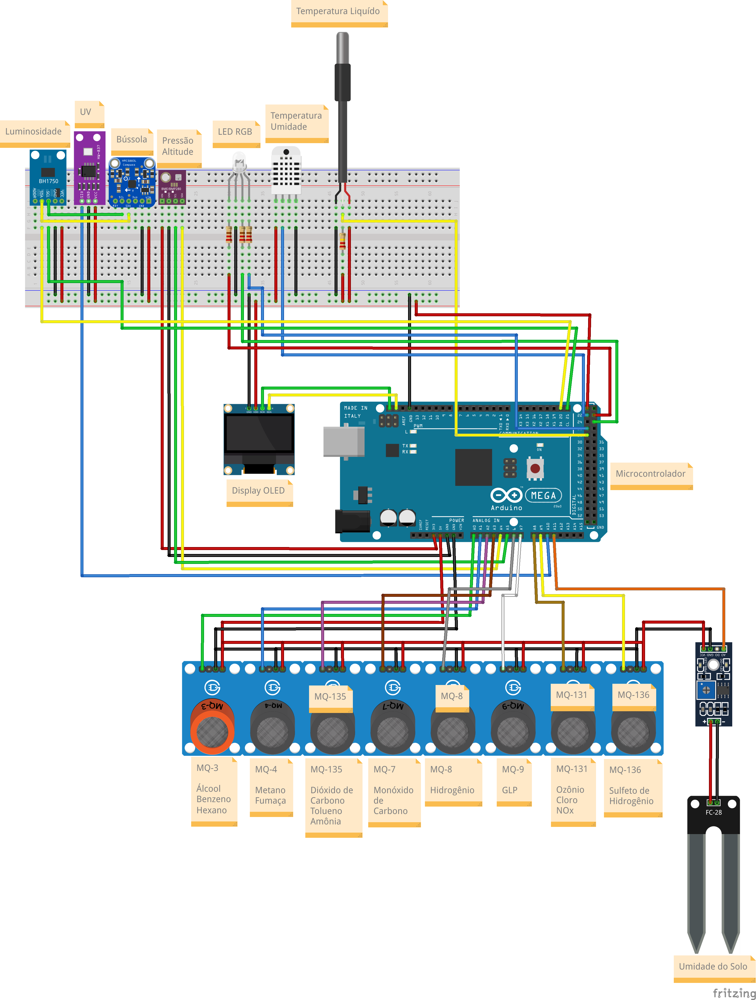

# Estação meteorológica portátil utilzando diversos módulos

### Componentes
---

- `Arduino Mega`: O microcontrolador que recebe os dados dos sensores.
- `LED RGB`:
    - `Branco`: Indica que o dispositivo está em processo de inicialização.
    - `Verde`: Indica que a coleta foi finalizada (Somente 1 piscada de 1 segundo).
    - `Azul` Indica que está em processo de coleta.
    - `Vermelho`: Indica que houve um erro no `BMP280`, `Display OLED`, `BH1750` ou falha no `GPS`.
- `Resistores de 220 Ohms`: Para diminuir um pouco a tensão dos `LEDs`, para não correr o risco de queimar os mesmos.
-  `Resistores de 220 Kilo Ohms`: Para diminuir um pouco a tensão dos `DS18B20`, para não correr o risco de queimar o sensor.
- `DS18B20`: Responsável pela coleta de temperatura do líquido.
- `BMP280`: Responsável por medir a pressão e altitude do ambiente.
- `DHT22`: Responsável por medir a temperatura e umidade do ambiente.
- `GY-NEO6MV2`: Responsável por coletar os dados de geolocalização e velocidade.
- `BH1750`: Responsável pela coleta da luminosidade.
- `GUVA S12SD`: Responsável pela coleta de índice de raios UV.
- `HMC5883L`: Responsável pela coleta dos dados de bússola.
- `YL-69`: Responsável pela coleta da umidade do solo.
- `MQ-3`: Responsável pela coleta de álcool, benzeno e hexano.
- `MQ-4`: Responsável pela coleta de metano e fumaça.
- `MQ-135`: Responsável pela coleta de dióxido de carbono, tolueno e amônia.
- `MQ-7`: Responsável pela coleta de monóxido de carbono.
- `MQ-8`: Responsável pela coleta de hidrogênio.
- `MQ-9`: Responsável pela coleta de GLP (Gás Liquefeito de Propano).
- `MQ-131`: Responsável pela coleta de ozônio, cloro e óxidos de hidrogênio.
- `MQ-136`: Responsável pela coleta de sulfeto de hidrogênio.
- `Display OLED`: Responsável pela parte visual do dispositivo.

### Bibliotecas Utilizadas
---

As bibliotecas de terceiros utilizadas para desenvolver esse projeto estão dentro da pasta `bibliotecas`, sendo elas:

- `Adafruit_BMP280`: Responsável pela coleta de dados barométricos (Pressão e altitude) do módulo `BMP280`.
- `DHT`: Responsável pela coleta de temperatura e umidade do módulo `DHT22` ou `DHT11`.
- `TinyGPSPlus`: Responsável pelo funcionamento do módulo de `GPS`.
- `BH1750`: Responsável pelo funcionamento do módulo de luminosidade (`BH1750`).
- `Adafruit_BusIO`, `Adafruit_GFX`, `Adafruit_SSD1306`: Responsáveis pelo funcionamento do `Display OLED`.
- `Adafruit_HMC5883_U` e `Adafruit_Sensors`: Responsáel pelo funcionamento do módulo `HMC5883L` (Bússola).
- `DallasTemperature`: Responsável pelo funcionamento do módulo `DS18B20`.
- `MQUnifiedsensor`: Responsável pelo funcionamento dos módulos `MQ`.

As demais bibliotecas utilizadas são bibliotecas disponibilizadas pela instalação padrão do `Arduino IDE``.

### Esquemático do Projeto
---

Aqui encontra-se como o projeto foi e deve ser montado:
